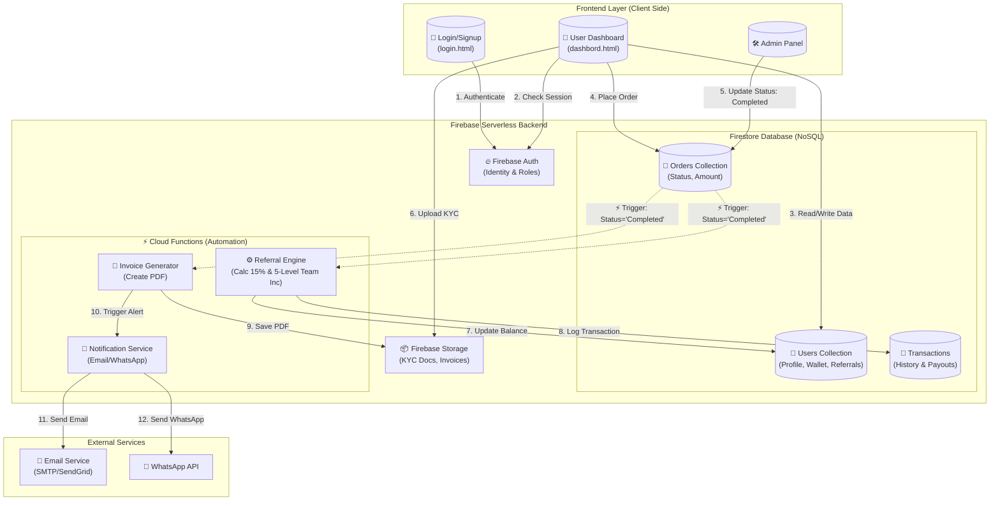

```mermaid
graph TD
    %% --- FRONTEND LAYER ---
    subgraph Client_Side ["Frontend Layer (Client Side)"]
        UI_User[("👤 User Dashboard<br>(dashbord.html)")]
        UI_Auth[("🔐 Login/Signup<br>(login.html)")]
        UI_Admin[("🛠 Admin Panel")]
    end

    %% --- FIREBASE BACKEND ---
    subgraph Firebase_Eco ["Firebase Serverless Backend"]
        
        %% Authentication
        FB_Auth["🔥 Firebase Auth<br>(Identity & Roles)"]

        %% Database
        subgraph Firestore ["Firestore Database (NoSQL)"]
            DB_Users[("📂 Users Collection<br>(Profile, Wallet, Referrals)")]
            DB_Orders[("📂 Orders Collection<br>(Status, Amount)")]
            DB_Trans[("📂 Transactions<br>(History & Payouts)")]
        end

        %% Storage
        FB_Store["📦 Firebase Storage<br>(KYC Docs, Invoices)"]

        %% Cloud Functions
        subgraph Cloud_Func ["⚡ Cloud Functions (Automation)"]
            Fn_Referral["⚙️ Referral Engine<br>(Calc 15% & 5-Level Team Inc)"]
            Fn_Invoice["📄 Invoice Generator<br>(Create PDF)"]
            Fn_Notify["🔔 Notification Service<br>(Email/WhatsApp)"]
        end
    end

    %% --- EXTERNAL SERVICES ---
    subgraph External ["External Services"]
        API_Mail["📧 Email Service<br>(SMTP/SendGrid)"]
        API_WA["💬 WhatsApp API"]
    end

    %% --- CONNECTIONS ---
    
    %% Auth Flow
    UI_Auth -->|1. Authenticate| FB_Auth
    UI_User -->|2. Check Session| FB_Auth
    
    %% Data Flow
    UI_User -->|3. Read/Write Data| DB_Users
    UI_User -->|4. Place Order| DB_Orders
    UI_Admin -->|5. Update Status: Completed| DB_Orders
    UI_User -->|6. Upload KYC| FB_Store

    %% Automation Triggers
    DB_Orders -.->|⚡ Trigger: Status='Completed'| Fn_Referral
    DB_Orders -.->|⚡ Trigger: Status='Completed'| Fn_Invoice
    
    %% Logic Execution
    Fn_Referral -->|7. Update Balance| DB_Users
    Fn_Referral -->|8. Log Transaction| DB_Trans
    
    Fn_Invoice -->|9. Save PDF| FB_Store
    Fn_Invoice -->|10. Trigger Alert| Fn_Notify
    
    %% External Outputs
    Fn_Notify -->|11. Send Email| API_Mail
    Fn_Notify -->|12. Send WhatsApp| API_WA
```
